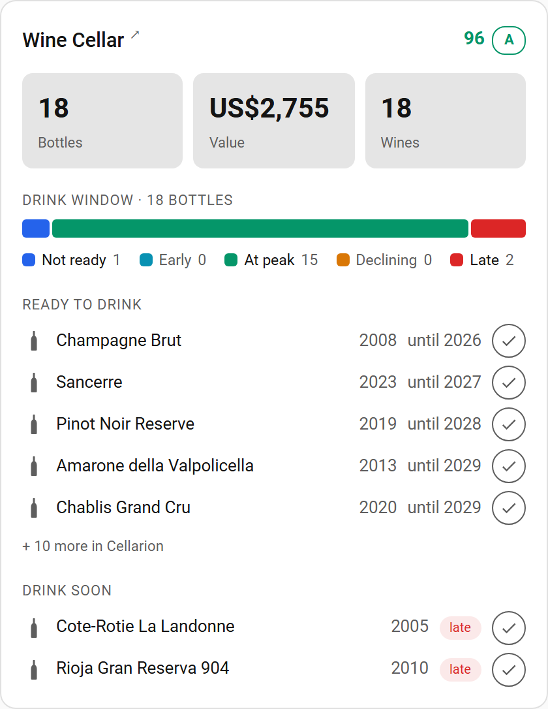
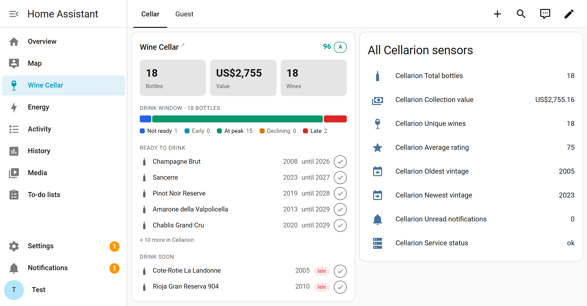

# Cellarion for Home Assistant

[](https://hacs.xyz)
[](https://github.com/jagduvi1/ha-cellarion/releases)
[](https://github.com/jagduvi1/ha-cellarion/actions/workflows/validate.yml)
[](LICENSE)

A Home Assistant custom integration for [Cellarion](https://cellarion.app) — the wine cellar management service. Track your collection, drink windows, and cellar value at **[cellarion.app](https://cellarion.app)**, and bring it all into your smart home. (Prefer to run your own? Cellarion can also be self-hosted — the integration works with both.)

Your wine data stays in your Cellarion account. This integration reads from the Cellarion API and exposes sensors in Home Assistant for dashboards and automations.

<p align="center">
  
</p>

## Features

- **Dashboard card included** — a ready-made card with collection stats, a drink-window bar, and the bottles that need attention; no extra install
- **Hide what you like** — switch off any part of the card (collection value, lists, consume buttons); handy for a dashboard guests can see
- **Collection overview** — total bottles, value, unique wines, average rating
- **Drink window tracking** — bottles at peak, declining, not ready, early/late window
- **Maturity alerts** — urgent bottles listed as sensor attributes
- **Consume from Home Assistant** — mark bottles drank/gifted/sold via the `cellarion.consume_bottle` service, from the card, automations, or NFC tags
- **Instant updates** — on Cellarion v1.75+, sensors update within seconds of a change (automatic, no ports to open)
- **Secure by default** — authenticates with a scoped API token; your Cellarion password is never stored in Home Assistant
- **Pace & runway** — intake per year, years until your cellar is empty
- **Cellar breakdown** — per-cellar bottle counts and values
- **Wine types & producers** — breakdown by type, top producers
- **Service health** — monitor your Cellarion instance status
- **Notifications** — unread notification count

## Installation

### HACS (Recommended)

1. Open HACS in Home Assistant
2. Click the three dots menu (top right) and select **Custom repositories**
3. Add this repository URL: `https://github.com/jagduvi1/ha-cellarion`
4. Select category: **Integration**
5. Click **Add**, then install **Cellarion**
6. Restart Home Assistant

### Manual

1. Copy the `custom_components/cellarion` folder into your Home Assistant `config/custom_components/` directory
2. Restart Home Assistant

## Configuration

1. Go to **Settings** > **Devices & Services** > **Add Integration**
2. Search for **Cellarion**
3. Enter the **URL** of your Cellarion instance — `https://cellarion.app`
   for the hosted service, or the address of your own server — and pick
   an authentication method:
   - **API token (recommended)** — create one in Cellarion under
     **Settings → API tokens** with the `read` and `consume` scopes and
     paste it in. Your password never touches Home Assistant.
   - **Email & password** — signs in once, creates a scoped API token for
     Home Assistant and does **not** store your password. Needs Cellarion
     1.75 or newer; older self-hosted servers must be updated first.
4. Done! Sensors will appear under the **Cellarion** device

### Options

After setup, the integration's **Configure** button lets you change the
polling interval. It is given in seconds, defaults to 1800 (30 minutes)
and cannot go below 300; changing it reloads the integration. While
instant updates are connected the interval only serves as a safety net
(see below).

### Running more than one account

Add the integration once per Cellarion account. Home Assistant gives the
second account's entities a `_2` suffix (`sensor.cellarion_total_bottles_2`
and so on). The bundled card and the `consume_bottle` service both take an
`entry_id` to pick the account; with a single account neither needs it.

### How updates arrive

The integration polls your Cellarion instance on the configured interval.
On Cellarion v1.75+ it also holds an outbound connection to the push
event stream and updates sensors within seconds of a change, relaxing
polling to a 6-hour safety net. This is detected automatically — no
configuration, and your Home Assistant never needs to be reachable from
the internet.

### Security

- Home Assistant stores a **scoped API token** (`read` + `consume`), not
  your Cellarion password — the password path only uses your credentials
  once to create the token.
- Tokens can be reviewed and revoked anytime in Cellarion under
  **Settings → API tokens**; revoking one triggers Home Assistant's
  re-authentication prompt.
- The password is never stored. Entries made with older versions of this
  integration against a server without token support are asked to
  re-authenticate once after updating; that mints a token and drops the
  stored password.

## Sensors

Sensors marked *disabled by default* can be enabled per entity under
**Settings → Devices & Services → Cellarion → entities**. The integration
also supports **reconfiguration** (change URL or credentials from the
entry's menu) and **diagnostics download** (token and account redacted).

| Sensor | Description | Attributes |
|--------|-------------|------------|
| Total bottles | Bottles in your collection | — |
| Collection value | Total value in your currency | currency, average price |
| Unique wines | Distinct wine definitions | — |
| Cellars | Number of cellars | per-cellar breakdown |
| Average rating | Mean rating across bottles | — |
| Countries | Countries represented (disabled by default) | top 5 countries |
| Bottles at peak | Ready to drink now | ready-to-drink list (name, vintage, drink-to window, with ids) |
| Bottles declining | Past peak, drink soon! | urgent bottles list (top 10, with ids) |
| Bottles not ready | Too young to open | — |
| Bottles early window | Approaching peak | — |
| Bottles late window | Past optimal window | — |
| Consumed bottles | Total consumed (increasing) | — |
| Intake per year | Average bottles added/year | — |
| Runway (years) | Years until cellar is empty | — |
| Oldest vintage | Oldest bottle year (disabled by default) | — |
| Newest vintage | Newest bottle year (disabled by default) | — |
| Health score | Collection health metric | grade |
| Unread notifications | Pending notifications | — |
| Wine types | Number of wine types (disabled by default) | type breakdown |
| Top producers | Number of top producers (disabled by default) | producer list (top 10) |
| Service status | Cellarion instance health | — |

## Services

### `cellarion.consume_bottle`

Mark a bottle as consumed in Cellarion — frees its rack slot and updates
your statistics, exactly like consuming it in the app.

| Field | Required | Description |
|-------|----------|-------------|
| `bottle_id` | yes | The Cellarion bottle id |
| `reason` | no | `drank` (default), `gifted`, `sold`, or `other` |
| `rating` | no | Rating to record with the consumption, 0–100 in steps of 0.5 |
| `note` | no | Tasting note or comment, up to 1000 characters |
| `entry_id` | no | Only when multiple Cellarion accounts are configured |

The bottle id is the 24-character id Cellarion shows in a bottle's URL and
that the card's lists carry in their `peak_bottles` / `urgent_bottles`
attributes. Any signed-in Home Assistant user can call the service, so
keep that in mind on shared installations.

Example — log a bottle by scanning an NFC tag on its rack slot:

```yaml
automation:
  - alias: "NFC: consume bottle"
    trigger:
      - platform: tag
        tag_id: rack-a1        # write the bottle id into the tag's automation
    action:
      - service: cellarion.consume_bottle
        data:
          bottle_id: "6a50805b785f507654afdc78"
          reason: drank
```

## Dashboard Examples

> **Home Assistant 2026+:** the default **Overview** dashboard is
> auto-generated and doesn't accept custom cards. Create your own under
> **Settings → Dashboards → Add dashboard → New dashboard from scratch**,
> then add cards there.

### Cellarion Card (bundled)



The integration ships with a custom Lovelace card and registers it
automatically — no extra install. Add it from the dashboard card picker
(**Custom: Cellarion Card**) or in YAML:

```yaml
type: custom:cellarion-card
title: Wine Cellar          # optional
url: https://cellarion.app  # optional — overrides the title link target
entry_id: <config entry>    # optional — picks the account when you run more
                            #   than one (choose it in the card editor)
```

The card finds its sensors through Home Assistant's entity registry, so
it keeps working if you rename entity ids, and a second Cellarion account
(whose entities Home Assistant names `sensor.cellarion_…_2`) is selected
with `entry_id`. Without `entry_id` and with several accounts, the card
shows the one that was set up first. If you ever need to force a specific
set of entity ids, the **Advanced** section of the editor (or
`prefix: sensor.cellarion` in YAML) does that.

It shows your collection stats, a drink-window distribution bar, a
**Ready to drink** list (bottles at their peak, soonest-closing window
first), and a **Drink soon** list (declining/late bottles). Clicking any
number opens the sensor's more-info dialog, the card title opens your
Cellarion instance, and — on Cellarion v1.75+ — every listed bottle gets
a one-tap consume button (with confirmation). For browsing your full
inventory, follow the card link into Cellarion itself. Anything you'd
rather not have on display can be switched off — see below. If your
dashboards run in YAML mode, add `/cellarion-files/cellarion-card.js`
as a module resource manually.

#### Hiding parts of the card

The card's parts can be switched off one by one — handy for a dashboard
in a shared room where you'd rather not put the collection's value on
display.
All of them default to `true`; set the ones you don't want to `false`,
either in YAML or with the **Show on the card** toggles in the card
editor.

| Option | Hides when `false` |
|--------|--------------------|
| `show_health` | Health score and grade in the header |
| `show_bottles` | The **Bottles** stat |
| `show_value` | The **Value** stat — your collection's worth |
| `show_wines` | The **Wines** stat |
| `show_drink_window` | The drink-window bar and its legend |
| `show_ready` | The **Ready to drink** list |
| `show_soon` | The **Drink soon** list |
| `show_consume` | The one-tap consume buttons on listed bottles |

```yaml
# A guest-friendly card: no cellar value, and visitors can't mark bottles
# as drunk by tapping.
type: custom:cellarion-card
title: Wine Cellar
show_value: false
show_consume: false
```

Hiding a stat only takes it off the card — the sensor itself stays
available for automations, and the service-status warning is never hidden.

#### Theming

The card takes its text and background colours from your Home Assistant
theme. Its semantic colours (the drink-window bar, the status chips, the
health score) can be overridden per theme:

```yaml
# themes.yaml
my_theme:
  cellarion-not-ready-color: "#2563EB"
  cellarion-early-color: "#0891B2"
  cellarion-peak-color: "#059669"
  cellarion-declining-color: "#D97706"
  cellarion-late-color: "#DC2626"
  cellarion-good-color: "#059669"   # health score ≥ 80, consume confirmation
  cellarion-warn-color: "#D97706"   # health score ≥ 60, warnings
  cellarion-bad-color: "#DC2626"    # health score < 60
```

Text in those colours is blended towards the theme's text colour, so it
stays readable on light and dark themes alike.

### Simple Entities Card

```yaml
type: entities
title: Wine Cellar
entities:
  - entity: sensor.cellarion_total_bottles
  - entity: sensor.cellarion_collection_value
  - entity: sensor.cellarion_bottles_at_peak
  - entity: sensor.cellarion_bottles_declining
  - entity: sensor.cellarion_runway_years
```

### Automation: Drink Window Alert

```yaml
automation:
  - alias: "Wine ready to drink"
    trigger:
      - platform: numeric_state
        entity_id: sensor.cellarion_bottles_at_peak
        above: 0
    action:
      - service: notify.mobile_app
        data:
          title: "Wine at peak!"
          message: >
            You have {{ states('sensor.cellarion_bottles_at_peak') }}
            bottles at their peak. Time to open one!
```

## Requirements

- Home Assistant 2025.2 or newer (the bundled brand icon shows on 2026.3+)
- A [cellarion.app](https://cellarion.app) account (or your own self-hosted Cellarion instance)
- Cellarion server v1.75 or newer (API tokens, instant updates and the
  card's consume button all arrived there)

## Troubleshooting

**"Re-authentication required" or the sensors turn unavailable after
working for a while.** Cellarion rejected the stored credential: the API
token was revoked in Cellarion, or (password-based setups on older
servers) the password changed. Open the notification and sign in again;
nothing else needs to change.

**The setup form says the token is missing the read scope, or Repairs
shows "Cellarion instant updates unavailable".** The token exists but
was created without the scope the integration needs. Create a new one in
Cellarion under **Settings → API tokens** with both the `read` and
`consume` scopes, then use **Reconfigure** on the integration to swap it
in. Polling keeps working in the meantime.

**"Set up with a stored password, which is no longer supported."** The
entry dates from before v1.10 and a server without API tokens. Open the
notification and sign in with email and password once; Home Assistant
gets a scoped token and the stored password is removed.

**"Rate limited by Cellarion" during setup.** Cellarion limits logins
per address and locks an account after repeated failures. Wait 15
minutes before trying again, and prefer the API-token method, which never
logs in at all.

**The card says "Cellarion entities not found".** The card looks up the
integration's sensors in the entity registry. If the integration is set
up and the message persists, the entities may be disabled or the card
has an explicit `prefix` that no longer matches; clear the prefix in
the editor's **Advanced** section.

**The card looks stale after an update.** The card file is versioned, so
a reload of the browser page picks up the new one. If a dashboard still
shows the old card, clear the browser cache for your Home Assistant URL.

**Self-hosted: instant updates never connect.** The push stream needs
the reverse proxy to pass `/api/events/stream` through without buffering
or compression (see the Cellarion docs on push events). Everything else
works over polling while that is being sorted out.

**The card's title link opens an address the browser can't reach.** The
link defaults to the URL the integration was configured with. If that is
an internal address (a Docker service name, for instance), set the card's
`url` option to the address you use in the browser.

## Known limitations

- **One card, one account.** A card shows a single account; with several,
  add one card per account and pick each account with `entry_id`.
- **Lists are capped.** The card shows the five bottles closest to leaving
  their window in each list and links into Cellarion for the rest; the
  `peak_bottles` and `urgent_bottles` attributes carry up to ten.
- **Instant updates need a pass-through proxy.** Self-hosted setups whose
  reverse proxy buffers or compresses `/api/events/stream` fall back to
  polling.
- **Consume only.** The service marks bottles as consumed; adding, moving
  or rating bottles stays in Cellarion.
- **Token revocation is manual.** Deleting the integration leaves its API
  token valid until you revoke it in Cellarion.
- **YAML-mode dashboards** need the card resource added by hand.

## Use cases

- **A cellar dashboard for the kitchen tablet** — the bundled card with
  `show_value: false` and `show_consume: false`, so guests see what is
  ready to drink without the collection's worth or a way to alter it.
- **"What should we open?" on the phone** — the card in the Home
  Assistant app: the *Ready to drink* list, one tap to consume when the
  cork is out.
- **A nudge before a window closes** — an automation on
  `sensor.cellarion_bottles_declining` that sends a notification listing
  the `urgent_bottles` attribute.
- **Logging by NFC** — a tag on each rack slot that calls
  `cellarion.consume_bottle` with that slot's bottle id (see Services).
- **Long-term charts** — `sensor.cellarion_total_bottles` and
  `sensor.cellarion_collection_value` feed the statistics graph card, so
  you can watch the cellar grow (or shrink) over years.

## Removing the integration

Delete the entry under **Settings → Devices & Services → Cellarion**. The
sensors, the device and any repair issue go with it. The API token that
was created for Home Assistant stays valid on the server until you revoke
it in Cellarion under **Settings → API tokens** — it is named
*Home Assistant (…)*.

## Development

A Docker-based Home Assistant test environment lives in [dev/](dev/):

```bash
cd dev
docker compose up -d
```

Open http://localhost:8123, create a user, and add the Cellarion integration.
The container joins the local Cellarion compose network, so use
`http://cellarion-backend:5000` as the instance URL. After changing the
integration code, run `docker compose restart homeassistant`.

To run the checks CI runs:

```bash
pip install -r requirements_test.txt
pytest tests                       # integration tests
node --test tests/                 # bundled card tests
ruff check . && mypy custom_components/cellarion
```

## License

MIT
